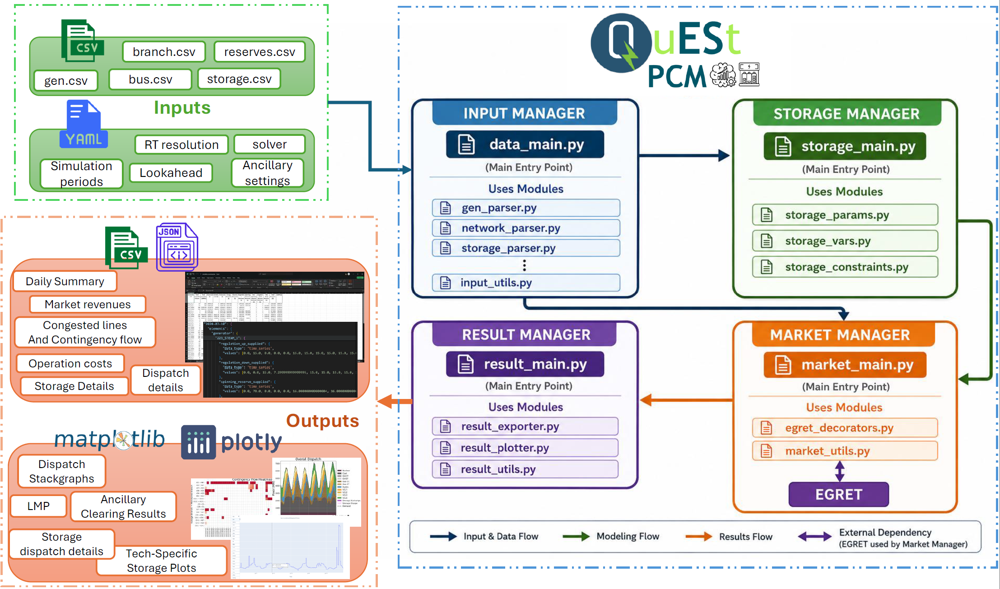
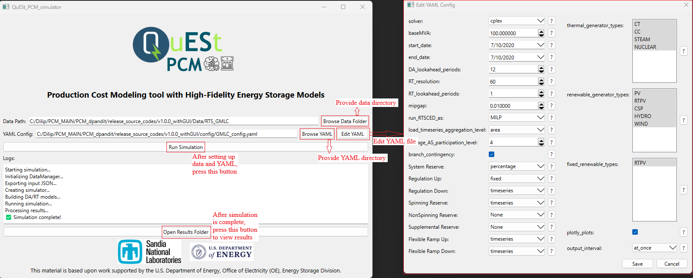

<a id="top"></a>

<div style="text-align: center;">
    
</div>

# **QuESt PCM**: A Production Cost Modeling Tool with High-Fidelity Models of Energy Storage Systems

Current release version: 1.1.0

## Table of Contents
- [Introduction](#intro)
- [Key Features of QuESt PCM](#key-features)
- [Getting Started](#getting-started)
- [Running QuESt PCM](#running-pcm)
- [Example Simulation](#example_simulation)
- [Acknowledgement](#acknowledgement)
- [Contact Details](#contact_details)

## Introduction 
<a id="intro"></a>

Production cost models (PCM) are computational tools that simulate power system operations by optimizing the commitment and dispatch of generation resources to meet demand at least cost, while respecting technical and reliability constraints. QuESt PCM is an open-source power system production cost modeling tool designed for high-fidelity representation of energy storage systems (ESS). Built in Python, it uses the Pyomo optimization interface to formulate technology-specific storage models and to capture diverse storage operational constraints. The tool also models market participation capabilities of storage systems, helping assess their impacts on day-ahead and real-time price signals. Python wrappers allow seamless simulation of market operations, and [EGRET](https://github.com/grid-parity-exchange/Egret/tree/main) serves as the optimization engine for security-constrained unit commitment and economic dispatch. This tool is part of [QuESt 2.0](https://github.com/sandialabs/snl-quest): Open-source Platform for Energy Storage Analytics. Below is a high-level overview of the QuESt PCM tool.
<div style="text-align: center;">

</div>

[Back to Top](#top)
## Key Features of QuESt PCM
<a id="Key-features"></a>
Key features of the QuESt PCM tool include:

- **Cost-Optimal Dispatch and Commitment:** Coordinates day-ahead and real-time simulations to determine least-cost generation dispatch while respecting technical and reliability constraints. The tool ensures proper initialization and coupling of intertemporal variables, maintaining consistency between day-ahead and real-time operations. Optimization problems are solved using EGRET, enabling accurate modeling of multi-period dispatch and commitment decisions.

- **High-Fidelity Energy Storage Modeling:** Accurately represents a broad range of energy storage technologies, capturing technology-specific operational constraints, charge/discharge behavior, efficiency characteristics, and degradation effects. Examples include cycling and aging characteristics of battery storage, as well as generator and pump dynamics of pumped hydro storage. The tool also evaluates the impact of storage operation on system flexibility, reliability, and cost.

- **Market Participation Simulation:** Models storage participation in both day-ahead and real-time markets to assess revenue potential and influence on market price signals. The tool addresses key challenges in integrating storage systems into production cost models, including ancillary service state-of-charge constraints, and incorporates rolling-horizon coordination to align day-ahead and real-time storage schedules.

- **Flexible Scenario Analysis:** Enables exploration of multiple operational and market scenarios to evaluate sensitivities under varying conditions. Users can configure real-time market clearing frequencies, lookahead horizons, and flexible allocation of ancillary services, including regulation, spinning, non-spinning, and supplemental reserves. Storage participation levels in these services can also be customized.

- **Open-Source and Extensible:** Built in Python with transparent, modifiable code for research, teaching, and practical power system studies.

[Back to Top](#top)
## Getting started
<a id="getting-started"></a>
### Installing Python
1. Installers can be found at: https://www.python.org/downloads/release/python-31212/
2. Make sure to check the box "Add Python to PATH" at the bottom of the installer prompt.

### Installing Git
- Visit [git-scm.com](https://git-scm.com/) to download Git for your operating system.
- Follow the installation instructions provided on the website.

### Solver Installation

By default, [HiGHs](<https://highs.dev/#top>) solver is included with the QuESt PCM installation. However, for best performance, use a commercial solver such as Gurobi and Cplex. Additional solvers to consider include:

**Commercial Solvers**
- [Gurobi](<https://www.gurobi.com/>)
- [Cplex](<https://www.ibm.com/products/ilog-cplex-optimization-studio>)

**Open-source Solvers**
- [Cbc](<https://github.com/coin-or/Cbc>)
- [SCIP](<https://www.scipopt.org/>)

### Setting Up a Virtual Environment
1. Install `virtualenv` (if not already installed):
    ```bash
    python -m pip install virtualenv
    ```

2. Create a virtual environment (named `pcm_venv`):
    ```bash
    python -m virtualenv pcm_venv
    ```

3. Activate the virtual environment:
   - On Windows:
     ```bash
     .\pcm_venv\Scripts\activate
     ```
   - On macOS/Linux:
     ```
     source pcm_venv/bin/activate
     ```

### Cloning the Repository and Installing Dependencies
1. Clone the repository:
    ```bash
    git clone <repository_url>
    ```
   Replace `<repository_url>` with the URL of the QuESt PCM repository.

2. Navigate to the QuESt PCM Directory:
    ```bash
    cd path/to/quest_PCM
    ```
   Replace `path/to/quest_PCM` with the name of the directory where QuESt PCM was cloned.

3. Install Dependencies:
    ```bash
    pip install -e .
    ```
[Back to Top](#top)

## Running QuESt PCM
<a id="running-pcm"></a>

### Setup the Input CSV Files

The network, generator, reserve, and storage data are all input as .csv files. They must be present within the [Data](Data/) directory. Each file must follow the specific format required by QuESt PCM. For detailed instructions on how to populate these files, see the [Data Requirements](https://github.com/sandialabs/quest_PCM/wiki/Data-Requirements) page.

### Configure the Input File

Before running the simulation, configure the input yaml file in [Config](config/) directory with the specific simulation parameters. Open the file in a text editor and adjust the parameters according to your requirements. The guidelines for setting up the config files are present in [Configuration Instructions](https://github.com/sandialabs/quest_PCM/wiki/Configuration).

### Option 1: Run the Program using Command Line

First, make sure that you are in the main project directory. Then, use the `example_script.py` to run the simulation. Before running, update the main_data_path, yaml_path, and result_path variables in the script to point to your desired system. Then, with your virtual environment activated, execute the script from the command line as follows:
```
python example_script.py
```
### Option 2: Run the Program using GUI
From any directory, with your virtual environment activated, run the command:
```bash
pcm
```

you can also run the program from the `quest_PCM` directory, with your virtual environment activated, run the command:
```bash
python -m pcm
```


When the GUI (shown below) opens, first browse to and select the data directory and YAML file. The YAML file can also be edited directly within the GUI to adjust simulation parameters. Once everything is set, click `Run Simulation`. After the simulation finishes, a new button `Open Results Folder` will appear that links to the results directory for that run.



### Analyze the Results

Simulation results are stored in the Results directory. Separate timestamp folders are generated for each simulation run. Some key results from each simulation run include: system generation dispatch, operation costs, ancillary service allocations, and storage dispatch characteristics. Detailed decription of QuESt PCM outputs and file organization are present in the [Output Details](https://github.com/sandialabs/quest_PCM/wiki/Tool-Outputs).

[Back to Top](#top)
## Example Simulation
<a id="example_simulation"></a>
Two test cases are included with the initial release of QuESt PCM. One test case includes a purely synthetic 5-bus system derived from [Prescient](https://github.com/grid-parity-exchange/Prescient/tree/main) examples. Users can use this system for quick tests. Another test case includes the IEEE [RTS-GMLC](https://github.com/GridMod/RTS-GMLC) synthetic grid, which is a publicly available test system that is derived from IEEE RTS-96 test system. Figure 1 displays the nodal model of the RTS-GMLC test case included within the tool. For representative simulation outputs and visualizations generated by QuESt PCM on the RTS-GMLC system, see the [Example Results](https://github.com/sandialabs/quest_PCM/wiki/Example-Results) page.


**Figure 1:** IEEE RTS-GMLC Test Case nodal model

[Back to Top](#top)
## Acknowledgment
<a id="acknowledgement"></a>
The QuESt PCM tool is developed and maintained by the [Energy Storage Analytics Group](<https://energy.sandia.gov/programs/energy-storage/analytics/>) at [Sandia National Laboratories](<https://www.sandia.gov/>). This material is based upon work supported by the **U.S. Department of Energy, Office of Electricity (OE), Energy Storage Division**.

**Project team:**
- Dilip Pandit
- Cody Newlun
- Atri Bera
- Tu Nguyen
- Eriel Cabrera
<p>
   
</p>

[Back to Top](#top)
## Contact Details
<a id="contact_details"></a>
For reporting bugs and other issues, please use the "Issues" feature of this repository. For more information regarding the tool and collaboration opportunities, please contact project developer: Dilip Pandit (`dpandit@sandia.gov`).


